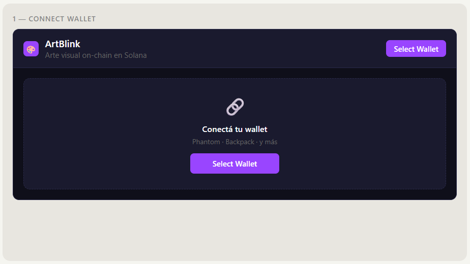
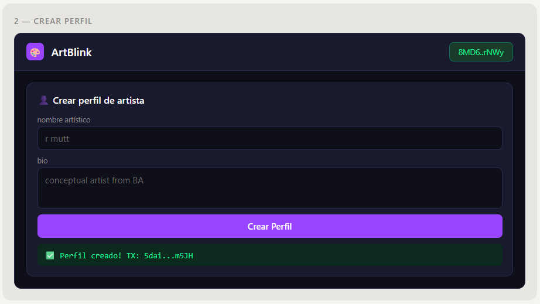
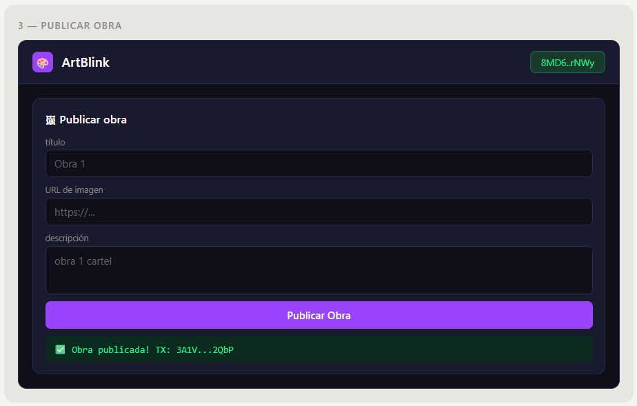
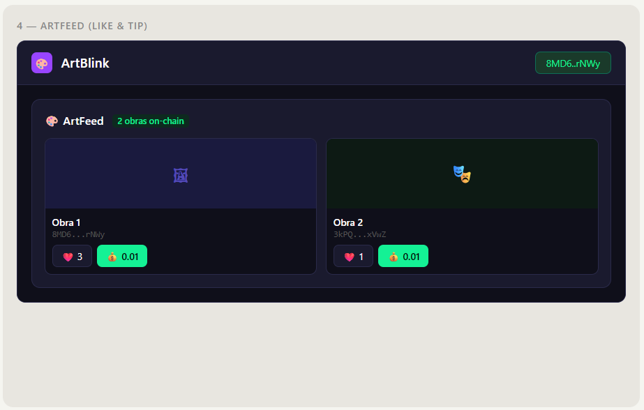
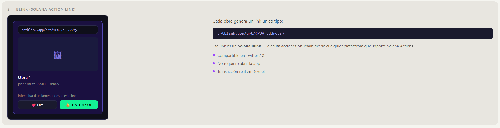

# 🎨 ArtBlink — Social On-Chain for Visual Artists

> A decentralized social network where visual artists publish artwork on-chain and anyone can like, tip, or collect — all powered by Solana.

Built for the **Solana WayLearn Hackathon 2026** · Deployed on **Devnet**

---

## 🔗 Live Program

| Network | Program ID |
|---------|-----------|
| Devnet  | `4pnH8WgSinm6T3LhYS7BRyySta4G88mtHWLZWs6Rux1D` |

---

## 🏗 What is ArtBlink?

ArtBlink combines three Solana primitives into one product:

- **Social On-Chain** — Artist profiles, artwork posts, likes and tips stored as PDAs on Solana
- **NFTs** — Each artwork is published on-chain with metadata (title, image URL, description, artist wallet)
- **Blinks** — Every artwork generates a shareable Solana Action link: `artblink.app/art/{PDA}` — anyone can like or tip directly from the link, no app needed

---

## 📁 Repository Structure

```
artblink/
├── program/               ← Anchor smart contract (Rust)
│   └── src/
│       └── lib.rs
├── frontend/              ← React + TypeScript frontend
│   ├── src/
│   │   ├── components/
│   │   │   ├── CreateProfile.tsx
│   │   │   ├── CreateArt.tsx
│   │   │   └── ArtFeed.tsx
│   │   ├── idl/
│   │   │   └── artblink.json
│   │   ├── App.tsx
│   │   └── index.tsx
│   └── package.json
├── docs/
│   └── mockups.png
└── README.md
```

---

## 🖼 Mockups

### Screen 1 — Connect Wallet


The landing screen. Users connect their Solana wallet (Phantom or Backpack). Without a wallet, the feed is read-only.

---

### Screen 2 — Create Artist Profile


Artists register on-chain by creating a profile PDA. Stores: name, bio, and total tips received.

**On-chain instruction:** `create_profile(name, bio)`
**PDA seeds:** `["profile", user_pubkey]`

---

### Screen 3 — Publish Artwork


Artists publish artwork by submitting a title, image URL and description. All data is stored in an `ArtPost` PDA on Solana — no centralized database.

**On-chain instruction:** `create_art(title, image_url, description)`
**PDA seeds:** `["art", user_pubkey, title]`

---

### Screen 4 — ArtFeed (Like & Tip)


The main feed reads all `ArtPost` accounts directly from the program using `program.account.artPost.all()`. Each card shows:
- Artwork image
- Title and artist wallet
- Like button (increments on-chain counter)
- Tip button (sends 0.01 SOL directly to artist wallet)

---

### Screen 5 — Blink (Solana Action Link)


Every artwork generates a shareable link:
```
artblink.app/art/4Lm6ueYAyW5fFSuuv3KV1azW3skbGRYuoseYk2RtZwXy
```

That link is a **Solana Blink** — an interactive action that lets anyone like or tip the artwork directly from the URL, without opening the app. Compatible with Twitter/X and any platform that supports Solana Actions.

---

## ⚙️ Smart Contract

Built with **Anchor** on **Solana Playground** — no local installation required.

### Instructions

| Instruction | Description |
|-------------|-------------|
| `create_profile(name, bio)` | Creates artist profile PDA |
| `create_art(title, image_url, description)` | Publishes artwork PDA |
| `like_art()` | Increments like counter on-chain |
| `tip_art(amount)` | Transfers SOL from tipper to artist |

### Data Models

```rust
pub struct ArtistProfile {
    pub owner: Pubkey,
    pub name: String,
    pub bio: String,
    pub total_tips: u64,
}

pub struct ArtPost {
    pub artist: Pubkey,
    pub title: String,
    pub image_url: String,
    pub description: String,
    pub likes: u64,
    pub tip_total: u64,
}
```

---

## ✅ Test Results (Devnet)

All instructions tested and verified on Solana Devnet:

```
✅ Profile created   TX: 5daixzc68Zy8DH3jstL6rLrUjYrUW7ZSzUJdmHRtEgXnvgim5JHJabnD1qH1gK887Yk...
✅ Artwork published  TX: 3A1VeofUJ6X73YU4YxqQ5zz6XQxuzWAn9M6sqMKNsvHfRF41iq8Cs34mRhseXebimFY...
✅ Like sent          TX: 2n39Fpp2nW1TxpEaPSQruhLMKwBt7FVydW6GvLDkAjjNr3NNhZvuyZg5nFo1yAP9sET...
✅ Tip 0.01 SOL sent  TX: 5LvavvV9YgDUkZP49Erbat3vCdXpJnRHHXoPTAgGUDyBx1ntEj4S4GhAzTJGNuqkEQk...
```

Verify on [Solana Explorer (Devnet)](https://explorer.solana.com/?cluster=devnet)

---

## 🚀 Run Locally

### Smart Contract

1. Go to [beta.solpg.io](https://beta.solpg.io)
2. Create a new Anchor project
3. Paste `program/src/lib.rs`
4. Click **Build** → **Deploy**

### Frontend

```bash
cd frontend
npm install --ignore-scripts
npm start
```

Requires:
- Node.js v18+
- Phantom or Backpack wallet on **Devnet**
- Devnet SOL from [faucet.solana.com](https://faucet.solana.com)

---

## 🛠 Tech Stack

| Layer | Tech |
|-------|------|
| Smart contract | Rust + Anchor 0.26.0 |
| Deploy environment | Solana Playground |
| Frontend | React 19 + TypeScript |
| Wallet | @solana/wallet-adapter (Phantom, Backpack) |
| On-chain client | @coral-xyz/anchor |
| Network | Solana Devnet |

---

## 🎯 Hackathon Categories

| Category | How ArtBlink qualifies |
|----------|----------------------|
| Social On-Chain | Profiles, posts, likes and tips all on-chain as PDAs |
| NFTs | Artwork published on-chain with metadata and artist ownership |
| Blinks | Every artwork PDA is a Solana Action link |

---

## 👤 Team

Built solo for the Solana WayLearn Hackathon 2026 · March 20–23

---

## 📄 License

MIT
